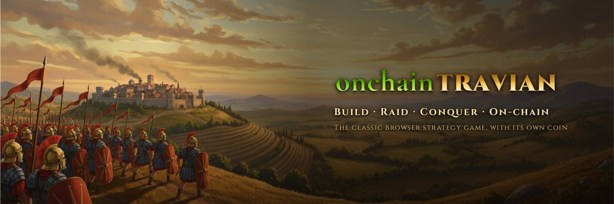
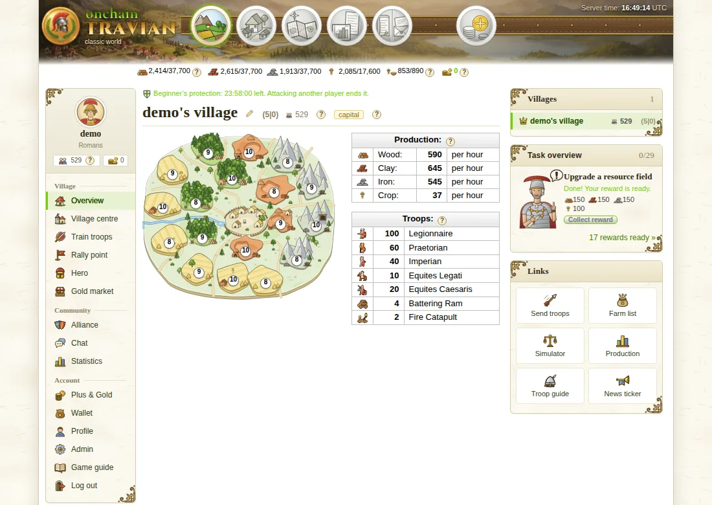
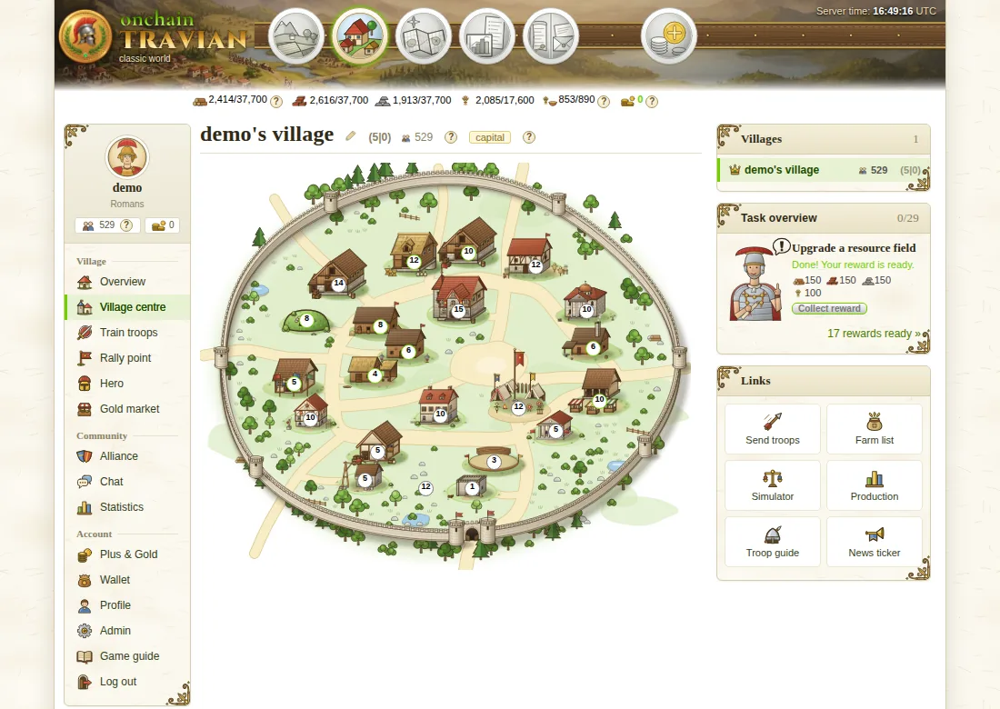
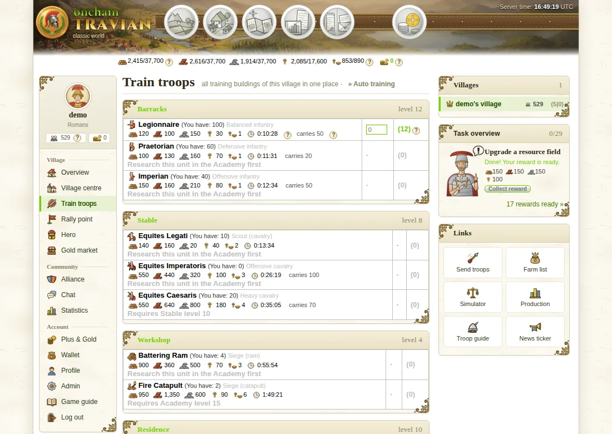
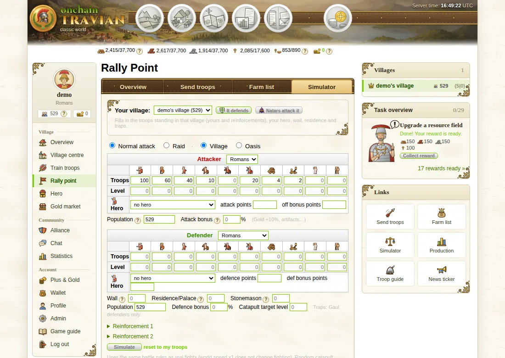
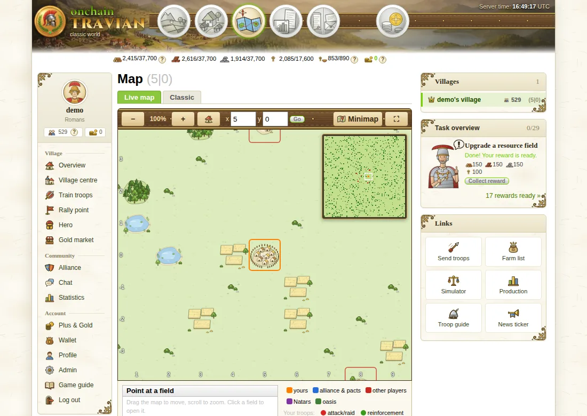
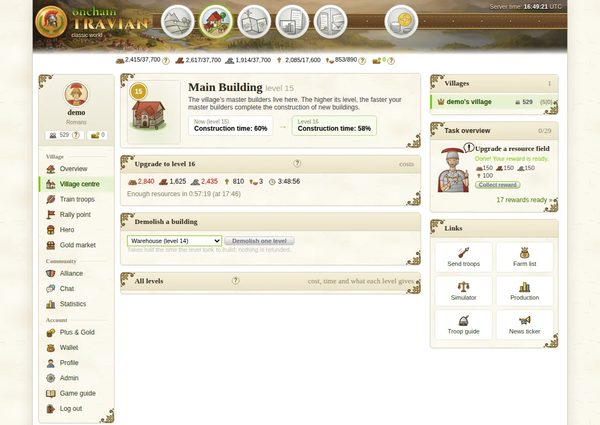
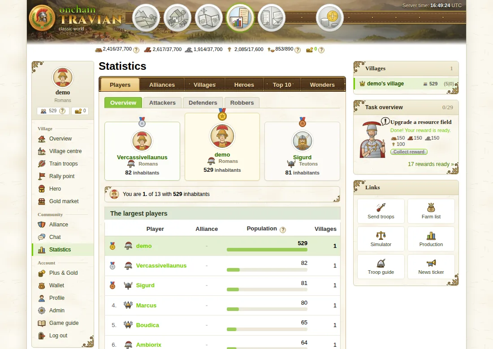
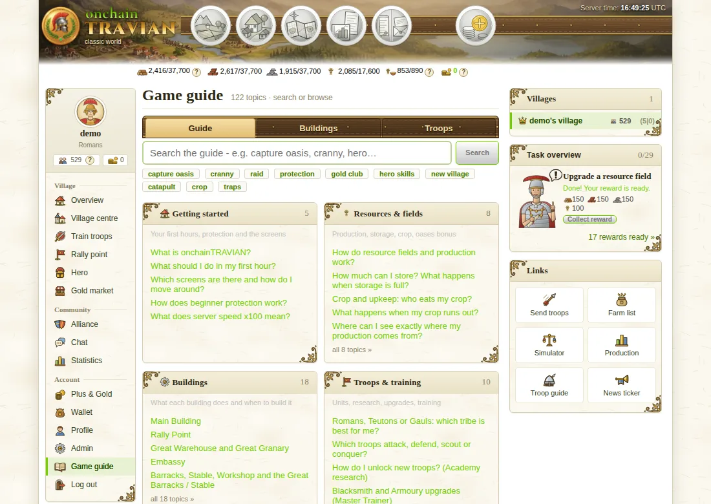
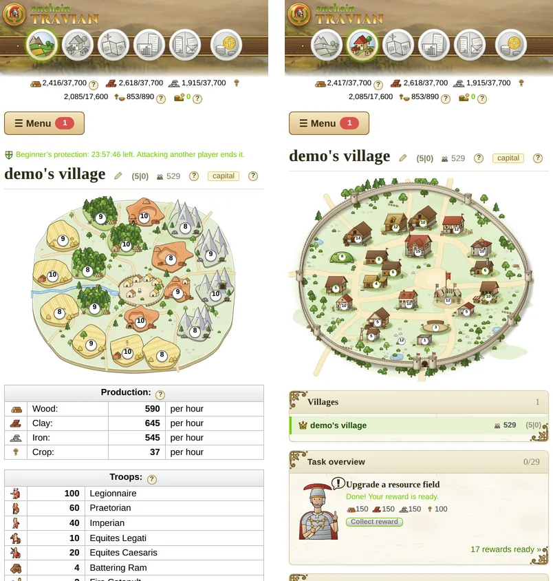

<p align="center">
  
</p>

<p align="center">
  <a href="https://github.com/onchainTRAVIAN/onchain-travian/actions/workflows/ci.yml"></a>
  
  
  
  <a href="LICENSE"></a>
  <a href="https://ancient-realms.up.railway.app"></a>
</p>

<p align="center"><b>The classic browser strategy game - rebuilt, with its own coin.</b><br>
Classic Travian 3.6 rules, hand-painted art, phones and PC, and an onchain economy on Robinhood Chain.</p>

<p align="center"><a href="https://ancient-realms.up.railway.app"><b>▶ Play now</b></a> · <a href="#features">Features</a> · <a href="#quick-start">Quick start</a> · <a href="#architecture">Architecture</a> · <a href="CHANGELOG.md">Changelog</a></p>

---

## Screenshots

<table>
  <tr>
    <td width="50%"><br><sub><b>Resource fields</b> - 18 fields, live production, troops at home</sub></td>
    <td width="50%"><br><sub><b>Village centre</b> - 22 building spots, pixel-precise clicks</sub></td>
  </tr>
  <tr>
    <td><br><sub><b>Train troops</b> - every training building on one page, plus auto training</sub></td>
    <td><br><sub><b>Combat simulator</b> - the exact battle engine the server uses</sub></td>
  </tr>
  <tr>
    <td><br><sub><b>Live map</b> - draggable world, minimap, troop movements</sub></td>
    <td><br><sub><b>Buildings</b> - costs, build times and full level tables</sub></td>
  </tr>
  <tr>
    <td><br><sub><b>Statistics</b> - players, alliances, attackers, defenders, robbers, top 10</sub></td>
    <td><br><sub><b>Game guide</b> - 120+ searchable topics, plus "?" help bubbles everywhere</sub></td>
  </tr>
</table>

<p align="center"><br><sub><b>Made for phones too</b> - same game, touch-friendly layout</sub></p>

## Features

**Classic gameplay (Travian 3.6 rules, exact numbers)**
- Romans, Teutons and Gauls with 10 units each; 38 buildings with T3.6 cost, time and effect formulas.
- Raids, attacks, scouting, reinforcements and catapult targets, using Kirilloid's T3 battle model (morale, walls, rams, demolition).
- Hero with XP, skills and revive; oases with wild animals; culture points, settlers, chiefs and conquest.
- Marketplace, trade offers, alliances with roles and treaties (confederacies, NAPs), messages, reports and rankings.
- Endgame: Natars, artifacts and World Wonders.

**Quality of life**
- Auto training (1-8 h plans by % share), farm lists with auto-raids, an oasis raider, trade routes, a cropper finder.
- Combat simulator that shares code with the real battle engine and is tested against it.
- Searchable game guide, a troop guide, and "?" help bubbles on every stat.
- Task system with rewards, a news ticker, chat, and live map movement markers.

**Onchain layer (Robinhood Chain, Arbitrum Orbit L2)**
- Sign-In with Ethereum: link a wallet or log in with it.
- Token-holder tiers (Bronze to Diamond). A tier uses the *lowest* of your recent balance snapshots, so a short buy doesn't qualify.
- ETH and token top-ups through the `GamePayments` contract, credited exactly once after confirmations by an indexer.
- Gold economy on an append-only ledger: shop boosts, instant finish, Gold market and player-to-player transfers.

## Quick start

```bash
git clone https://github.com/onchainTRAVIAN/onchain-travian.git
cd onchain-travian
npm install
cp .env.example .env        # world speed, map size, prices, crypto settings
npm run seed                # optional demo data: log in as "demo" / "demo12345"
npm run dev                 # http://localhost:3000
```

The first account that registers becomes the admin (`/admin`). In production, run `npm run build && npm start` with `NODE_ENV=production` and a real `SESSION_SECRET`.

<details>
<summary><b>Crypto on a local chain (Foundry)</b></summary>

```bash
anvil --block-time 2                          # terminal 1
(cd contracts && forge build)                 # compile the contracts once
npm run chain:deploy                          # deploys token + GamePayments, prints .env lines
# paste the printed lines into .env, then: npm run dev
```

Crypto features switch off cleanly when `RPC_URL` / `PAYMENTS_ADDRESS` / `TOKEN_ADDRESS` are empty. For testnet deploys see [`contracts/README.md`](contracts/README.md).
</details>

## Architecture

| Layer | Tech |
|---|---|
| Server | Node 22, Express 5, TypeScript strict, server-rendered HTML (no client framework) |
| Data | SQLite (better-sqlite3) + Drizzle ORM migrations |
| Security | Zod validation, Argon2id, helmet with a strict `'self'` CSP, CSRF tokens, rate limits |
| Chain | viem, SIWE, Solidity 0.8.24 + Foundry |
| Hosting | Railway (single instance, volume-mounted SQLite) |

- **Lazy simulation:** resources, training, loyalty, hero health and culture points are computed from timestamps on read (`src/game/engine/state.ts`). All time goes through `clock.now()`.
- **Ordered events:** construction, research, arrivals and revivals run strictly in time order (`processDue` in `src/game/engine/events.ts`), both from a 1 s worker and before every request.
- **Pure rules:** `src/game/rules/` holds pure functions (units, buildings, production, battle) pinned by reference-value tests.
- **One bonus pipeline:** every bonus (shop, holder tier, artifact) is a `perks` row read through `getModifiers()` with caps.
- **Escape by default:** views use a tagged `html` template that escapes every value.

```
src/
  app.ts, server.ts      Express app / process entry, world tick
  game/rules/            pure T3.6 formulas: units, buildings, battle, simulator, tasks
  game/engine/           lazy state, ordered events, artifacts, defence snapshots
  game/actions/          player actions (build, train, send, market, alliance, gold club ...)
  crypto/                SIWE wallet, holder tiers, deposit indexer, workers
  web/routes, web/views  HTTP routes and server-rendered views
  web/public/            CSS, app.js, art (SVG/WebP)
contracts/               GamePayments + test token (Foundry)
tests/                   200+ Vitest tests: rules, combat, flows, HTTP, security, on-chain
scripts/                 seed, local chain deploy, art generators
```

## Scripts

| Command | What it does |
|---|---|
| `npm run dev` | Dev server with reload |
| `npm test` | Unit, game-flow, HTTP and on-chain tests (anvil tests run when Foundry is installed) |
| `npm run typecheck` | Strict TypeScript check |
| `npm run build` / `npm start` | Production build / start |
| `npm run db:generate` | Create a migration after editing `src/db/schema.ts` |
| `npm run seed` | Demo data |
| `npm run chain:deploy` | Deploy the contracts to a local anvil node |
| `cd contracts && forge test` | Contract tests |

## Security

Please don't open public issues for vulnerabilities - see [SECURITY.md](SECURITY.md).

## License

Copyright © 2026 onchainTRAVIAN. **All rights reserved.** This repository is public for transparency only; no licence is granted to copy, run, modify or redistribute any part of it. See [LICENSE](LICENSE).

onchainTRAVIAN is an independent fan-made game inspired by the classic browser game. All artwork is original. Travian is a trademark of Travian Games GmbH; this project is not affiliated with or endorsed by them.
